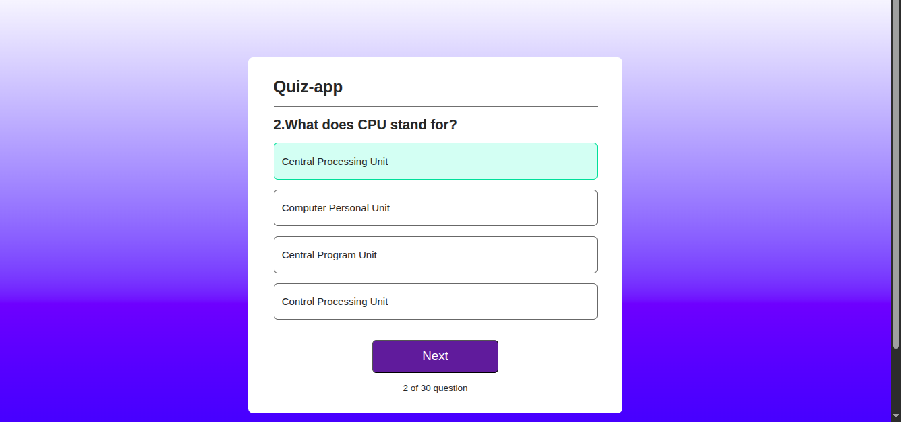
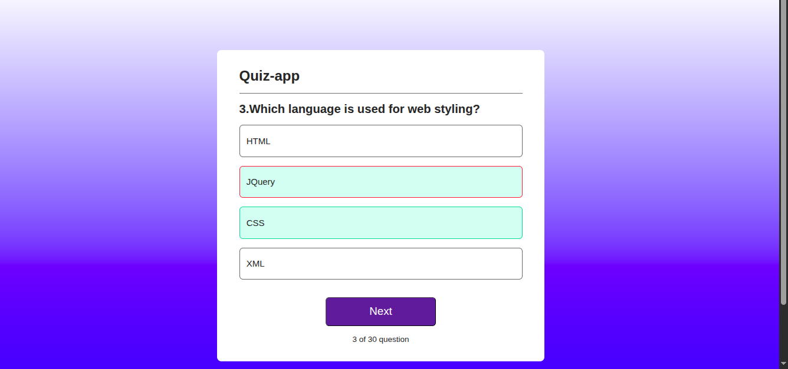

# Quiz Maker App 🎯

A **React-based Quiz App** designed to help IT students and tech enthusiasts practice multiple-choice questions in the IT and technology field.  

Currently, the app uses **manually collected questions** to provide interactive quizzes with instant feedback and score tracking.  

**Future Enhancement:** Plans to integrate AI to generate dynamic quizzes online, turning it into a full-featured **online Quiz Maker**.  

---

## 🌟 Features

- Take interactive multiple-choice quizzes  
- Instant feedback for correct and incorrect answers  
- Track your score and see results at the end  
- Reset quizzes to try again  
- Clean, responsive, and user-friendly interface  
- Focused on IT and technology-related questions  
- **Future goal:** AI-powered dynamic quiz generation  

---

## 🛠 Built With

- **React.js** – Functional components & hooks  
- **CSS** – Styling and layout  
- **Vite / Create React App** – Project setup and build  
- **React DevTools** – Optional debugging tool  

---

## 📸 Screenshots


[Quiz Screen]


[Result Screen]

---

## 🚀 Live Demo

The app is deployed and live on **Vercel**:  
[https://quiz-rfgl5yol8-rinju-pokhrels-projects.vercel.app](https://quiz-rfgl5yol8-rinju-pokhrels-projects.vercel.app)  

> This is the production deployment URL from Vercel.  

---

## 💻 Getting Started (Local Setup)

Follow these steps to run the project locally:  

### 1. Clone the repository
```bash
git clone https://github.com/Rinju-Pokhrel1/Quiz-app.git
cd Quiz-app
